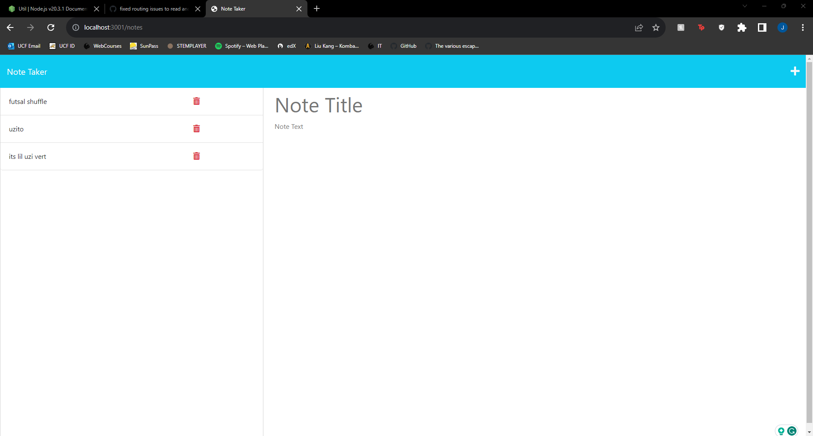
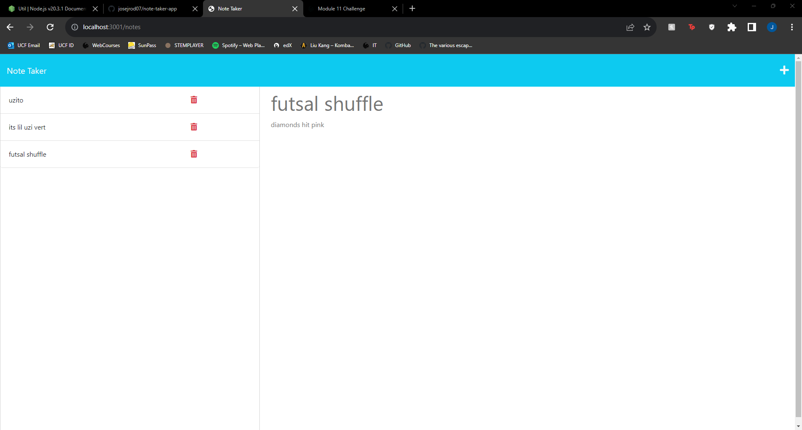

# Note Taker

This is a Node.js application that allows users to write and save notes. This application utilizes Express.js and saves the note data in a JSON file on the back end to ensure that the notes persist even after closing or refreshing the page.

## Table of Contents

- [Usage](#usage)
- [Views](#views)
- [Technologies Used](#technologies-used)
- [License](#license)

## Usage

1. Click the link to the deployed website: (https://evenbetternotetaker-aa51b7837a68.herokuapp.com/)
2. When you open the Note Taker, you will be presented with a landing page that displays a link to a notes page. Click on the link to navigate to the notes page.
3. On the notes page, you will see two columns. The left-hand column displays the existing notes, and the right-hand column contains empty fields to enter a new note title and the note's text.
4. To create a new note, enter the desired title and text in the input fields on the right-hand column.
5. As soon as you start typing in the fields, a Save icon will appear in the navigation bar at the top of the page.
6. Click on the Save icon to save the new note. The note will then appear in the left-hand column along with the other existing notes.
7. To view the content of an existing note, simply click on the note's title in the left-hand column. The note will be displayed in the right-hand column, allowing you to review or make any changes.
8. If you wish to create a new note, you can click on the Write icon in the navigation bar at the top of the page. This will clear the existing note's fields and present you with empty fields to enter a new note title and the note's text in the right-hand column.

## Views

## Techonologies Used

- Express.js
- JSON
- HTML
- CSS
- JavaScript

## License

This project is licensed under the MIT License - see the LICENSE file for details.